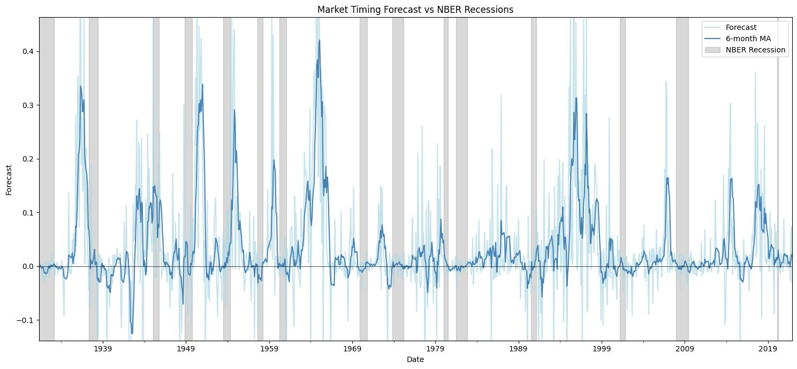
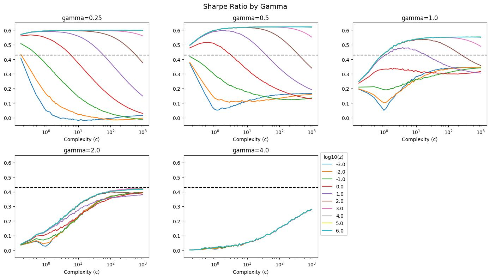

# The Virtue of Complexity in Return Prediction

A replication of Kelly, Malamud & Zhou (2021) demonstrating that high-complexity models outperform simpler ones in equity return prediction.

**Author:** Oualid Missaoui

## Paper

Kelly, B., Malamud, S., & Zhou, K. (2021). *The Virtue of Complexity in Return Prediction*. [SSRN](https://ssrn.com/abstract=3984925)

## Quick Start

```bash
pip install -r requirements.txt
```

```python
from src import load_data, RandomFourierFeatures, Backtest

features, returns = load_data()
rff = RandomFourierFeatures(gamma=2.0, n_features=6000)
rff_features = rff.transform(features, seed=42)

bt = Backtest(ridge_lambda=1000, train_window=12)
bt.predict(features=rff_features, returns=returns.shift(-1))
print(bt.calc_performance())
```

## Project Structure

```
├── src/                 # Source modules (config, dataset, rff, backtest)
├── notebooks/           # experimentation.ipynb - full replication
├── data/                # Welch-Goyal dataset (source data)
├── cache/               # Pre-computed simulation results
├── plots/               # Generated visualizations
├── docs/                # Original paper PDF
└── requirements.txt
```

## Data

**Source data** (`data/`):
| File | Description | Source |
|------|-------------|--------|
| `PredictorData2021 - Monthly.csv` | Welch-Goyal predictors | [Amit Goyal's website](https://sites.google.com/view/agoyal145/) |
| `definitions.xlsx` | Variable definitions | [Amit Goyal's website](https://sites.google.com/view/agoyal145/) |
| `NBER_20210719_cycle_dates_pasted.csv` | Recession dates | [NBER](http://data.nber.org/data/cycles/) |

**Pre-computed results** (`cache/`):
| File | Description |
|------|-------------|
| `metrics.parquet` | Simulation results (~2M runs, 96 MB) |

The `metrics.parquet` file is included so you can run the notebook instantly. To regenerate it yourself (takes multiple hours), delete or move the file and re-run the notebook.

## Results

### Market Timing vs Recessions


### Sharpe Ratio by Complexity


## Key Finding

Models with complexity ratio c = P/T >> 1 (more features than observations) achieve superior out-of-sample Sharpe ratios when properly regularized with ridge regression.
